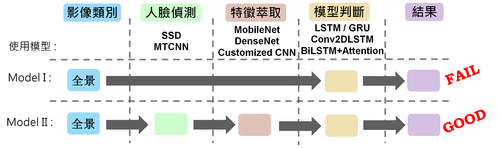

# 疲勞駕駛偵測
這是人工智慧學校的期末專題, 想了一些處理的流程以及運用不同的 CNN 、 LSTM 模型來做疲勞駕駛的偵測.
過程中也嘗試自己設計一個神經網路來降低計算量(抽取特徵部份).
目前可以做到呵欠程度的偵測, 未來還可再加上閉眼的偵測.

+ [目錄結構](#目錄結構)

+ [模型與流程](#模型與流程)

# 目錄結構
根目錄這邊有資料集、人臉偵測、特徵抽取、以及模型四個子目錄.
| Name | Description |
| ---- | ----------- |
| YawDD | YawDD 資料集 - 標記檔 |
| aiaDDD | aiaDDD 資料集 - 標記檔 |
| SSDface | 使用 SSD 做人臉偵測 |
| MTCNNface | 使用 MTCNN 做人臉偵測, 同時找人臉的五個關鍵點 |
| feaExtract | 使用 dense121, mobilenet, mobilenet_v2 來抽取 features |
| model1 | 單張不做人臉偵測直接偵測呵欠程度 - Failed |
| model2 | 多張、人臉偵測、特徵抽取、模型判斷呵欠程度 - Good |
        
# 模型與流程
主要的概念有兩種, 一是單張圖來偵測, 二是由於呵欠通常是連續性的動作, 所以使用多張圖來套用時間序列相關模型.

