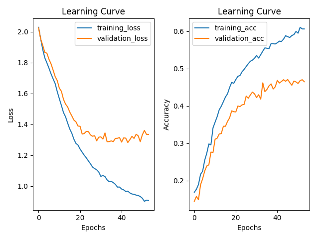
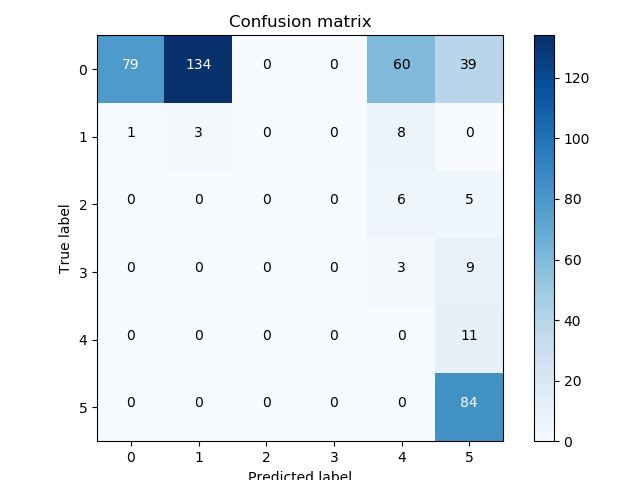
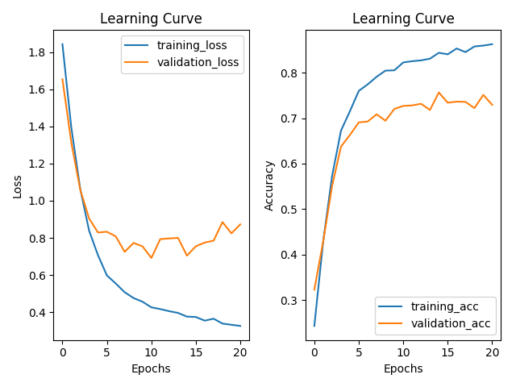
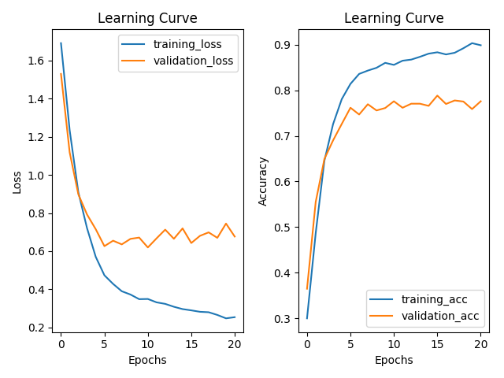

# Model1 - 單張直接偵測呵欠程度

| Name | Description |
| ---- | -------- |
| pic_gen_YawDD.py | 從 YawDD 中直接根據單張 frame 的呵欠程度來存成不同的 folder |
| yawn_train.csv | Training set |
| yawn_test.csv | Testing set |
| models.py | 用來 training 的檔案 |
| inference.py | 推論 test set 的結果 |
| ymutils.py | 一些 utility 跟畫 confusion matrix |
| result | 結果圖 |


## 流程
首先先切好 training 以及 testing set 的影片, 利用程式直接根據呵欠程度, 解出一張一張的 jpeg.
```
/AIA_Final_DrowsyDriverDetection$ python pic_gen_YawDD.py
```

然後利用 Keras 的 ImageDataGenerator 加上 generator 的 ``flow_from_directory`` 做呵欠程度 0, 1, 2, 3, 4, 5 的分類.
```
/AIA_Final_DrowsyDriverDetection$ python models.py
```

## 結果
硬分正確率不佳, 使用 ResNet 僅到 45% 左右.


由 confusion matrix 來看, 分錯的部份也不是分到相近的類別.


因此放棄此作法.


## Appendix
過程中不小心拿驗證標記的 video 來做為 training, 得到不錯的正確率.


