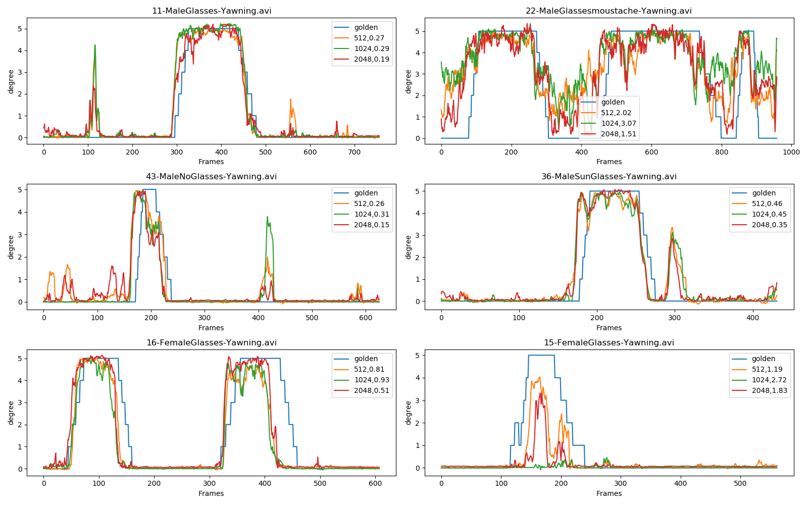
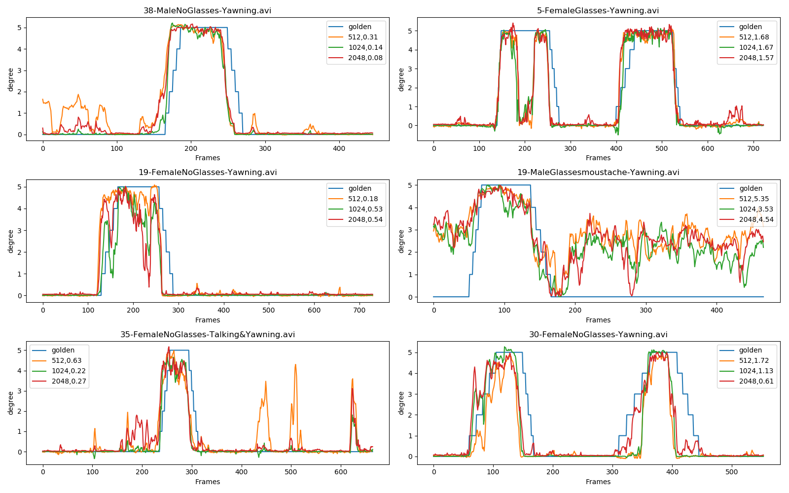
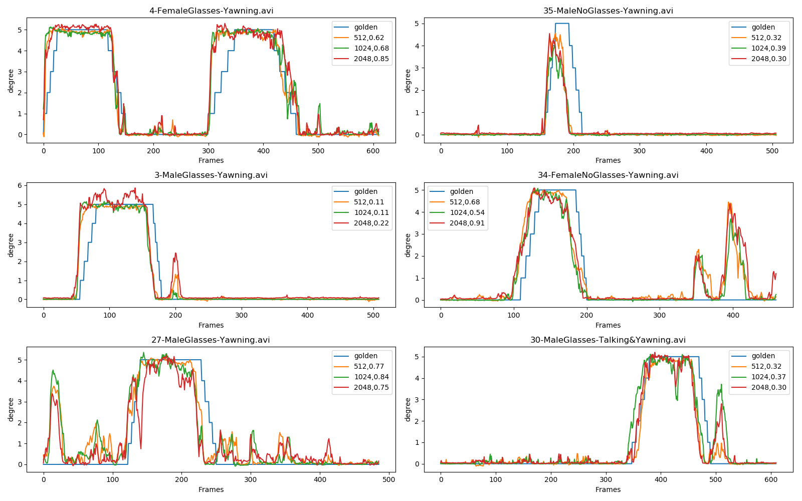
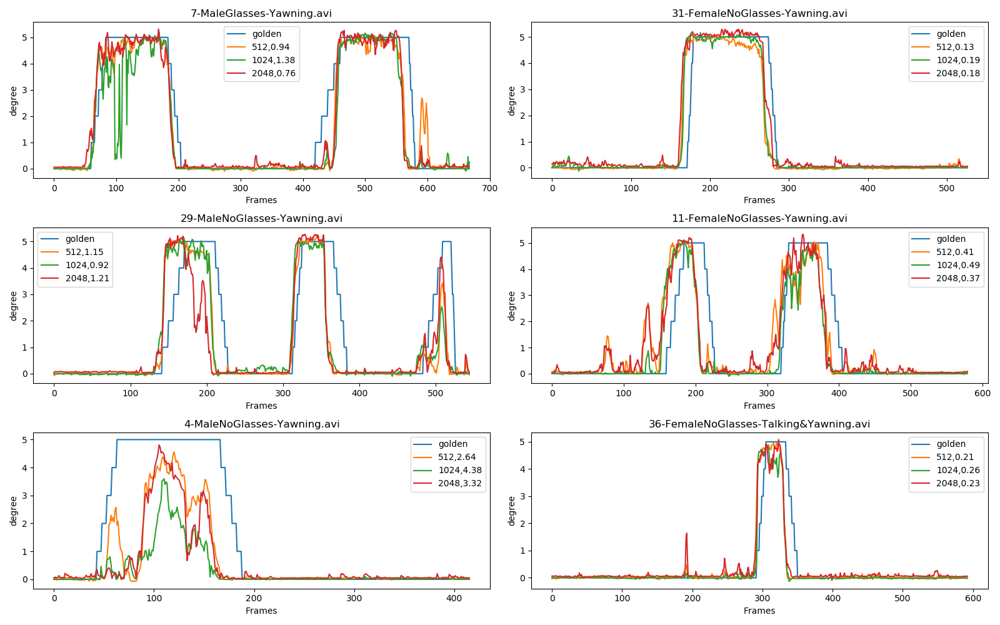
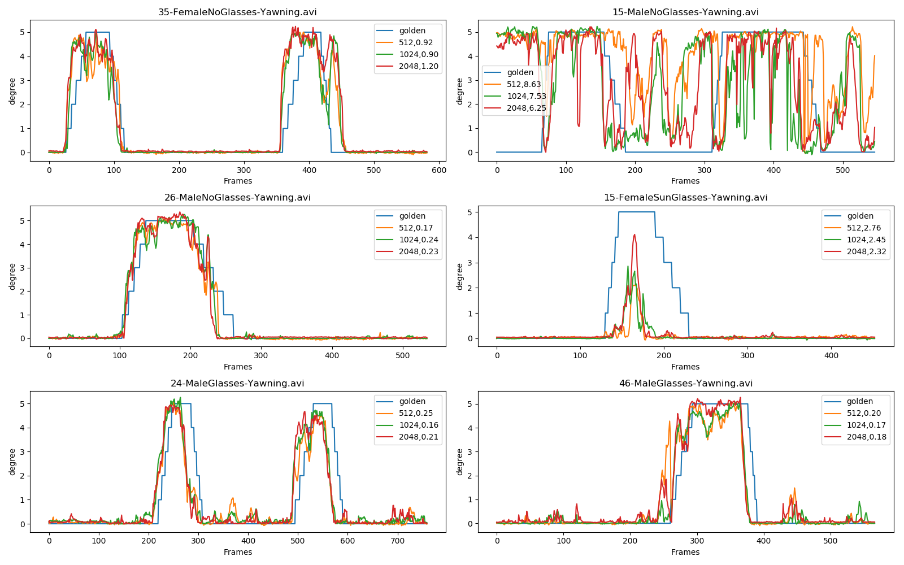
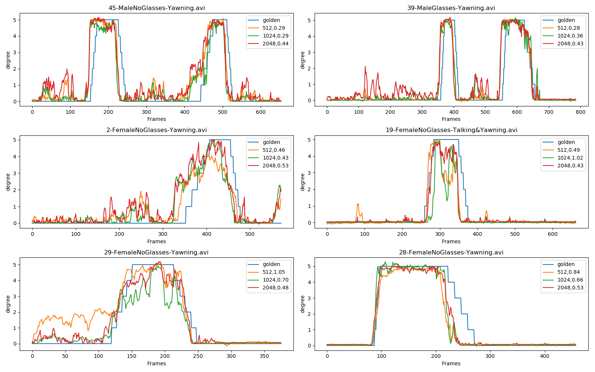
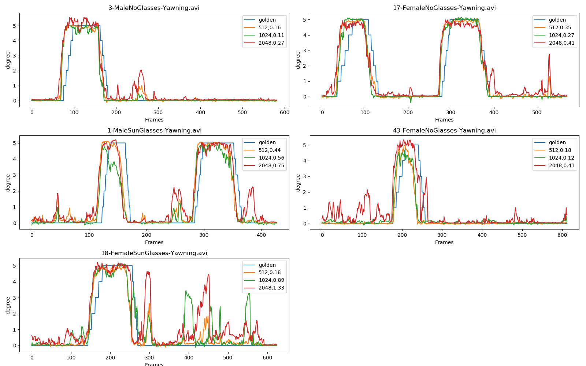

# YawDD - 自定義嘴巴區域相關實驗 (主要決定要抽多少 features)


## 目錄結構

| Name | Description |
| ---- | -------- |
| makekeyset.sh | 在使用 batch 檔時用來改 config.py 裡的參數 |
| config.py | 設定要選擇的 feature 個數 |
| bbox2fea\_roi.py | 每個 video 每張 frame 抽取預定義位置的嘴巴區域的 feature 數並存成 .npy 檔 |
| verify.py | 將預定義位置嘴巴區域畫在 video 上來驗證位置是否正確 |
| dense\_fea\_extract.py | dense121 抽 feature 的 class code |
| mobilenet\_fea\_extract.py | mobilenet 抽 feature 的 class code |
| mobilenetv2\_fea\_extract.py | mobilenet v2 版抽 feature 的 class code, 最後因為平台沒更新而沒有使用. |
| mobilenet\_custom\_fea\_extract.py | Transfer learning 過的 mobilenet 抽 feature 的 class code |
| mobilecus\_fea\_512.h5 | mobilenet\_custom\_fea\_extract.py 的原始模型檔 |
| lstm.py | 讀入 .npy 檔, 利用 LSTM 的方式來做訓練 |
| lstm\_inference.py | 讀入存入的 LSTM model, 對於 training set / testing set 做推論動作, 得知結果. |
| res\_cmp.py | 比較不同的 features 的結果 |
| lstm\_dense121_\[512,1024,2048\]\_yawn\_valid.pickle | validation set 結果檔 |
| lstm\_dense121_\[512,1024,2048\]\_yawn\_test.pickle | test set 結果檔 |
| res\_dense121_\[512,1024,2048\]\_yawn\_\[valid,test\].pickle | 每個 video 的比較單張圖檔 |

## 操作順序

```
$ python verify.py
$ python bbox2fea_roi.py
$ python lstm.py
$ python lstm_inference.py
$ python res_cmp.py
```

## 實驗結果 - 512 features 足夠好

由下面 validation 及 test sets 的表現看來, 512 features 就已經足夠好了.

### Validation Set





### Test Set




