# aiaDDD - 自定義嘴巴區域


## 目錄結構

| Name | Description |
| ---- | -------- |
| makekeyset.sh | 在使用 batch 檔時用來改 config.py 裡的參數 |
| config.py | 設定要選擇的 feature 個數 |
| bbroi\_check.py | 畫出預定義位置到影片上確認框的位置是否恰當 |
| bbox2fea\_roi.py | 每個 video 每張 frame 抽取預定義位置的嘴巴區域的 feature 數並存成 .npy 檔 |
| dense\_fea\_extract.py | dense121 抽 feature 的 class code |
| mobilenet\_fea\_extract.py | mobilenet 抽 feature 的 class code |
| mobilenetv2\_fea\_extract.py | mobilenet v2 版抽 feature 的 class code, 最後因為平台沒更新而沒有使用. |
| mobilenet\_custom\_fea\_extract.py | Transfer learning 過的 mobilenet 抽 feature 的 class code |
| mobilecus\_fea\_512.h5 | mobilenet\_custom\_fea\_extract.py 的原始模型檔 |
| lstm.py | 讀入 .npy 檔, 利用 LSTM 的方式來做訓練 |
| lstm\_inference.py | 讀入存入的 LSTM model, 對於 training set / testing set 做推論動作, 得知結果. |
| res\_cmp.py | 同一個 extractor 中, 比較不同的 features 的結果 |
| res\_cmp\_subplot.py | 同上, 幾個結果畫在一起 |
| fea\_cmp.py | 比較不同 extractor 跟不同 feature 數的結果  |
| fea\_cmp\_subplot.py | 同上, 幾個結果畫在一起 |
| lstm\_dense121\_\[512,1024,2048\]\_test.pickle | test set 結果檔 |
| lstm\_mobilenet\_\[512,1024,2048\]\_test.pickle |  |
| lstm\_mobilecus\_512\_test.pickle | 基於 dataset train 完的 feature extractor 的結果. |

## 操作順序

```
$ python verify.py
$ python bbox2fea_roi.py
$ python lstm.py
$ python lstm_inference.py
$ python res_cmp.py
```

## 實驗結果 - 基於 dataset train 完的 mobilenet 最佳.

先再看一次 feature 個數的選擇

### Dense121
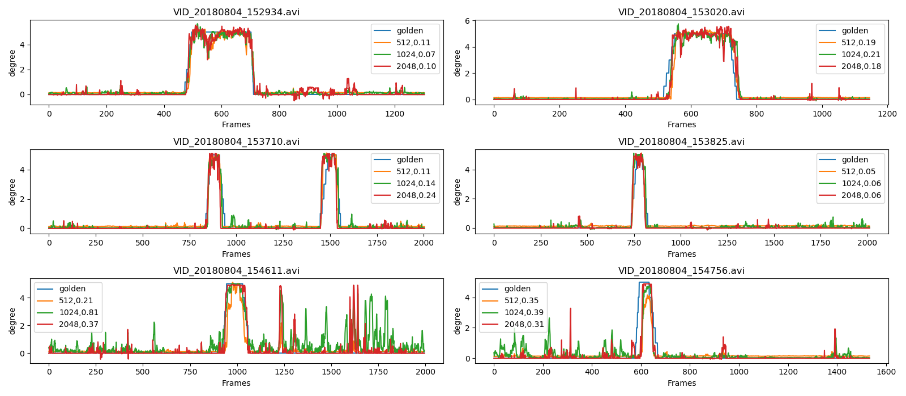
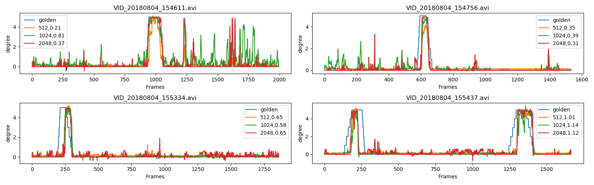
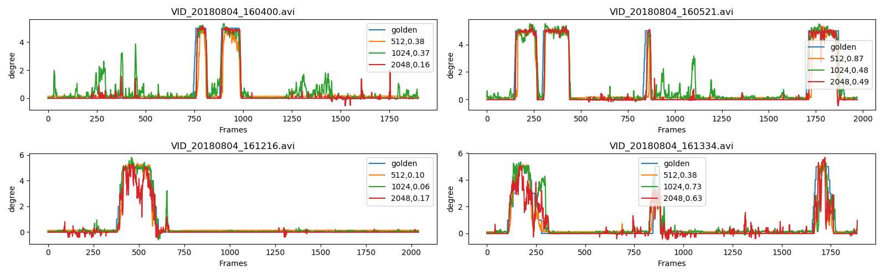
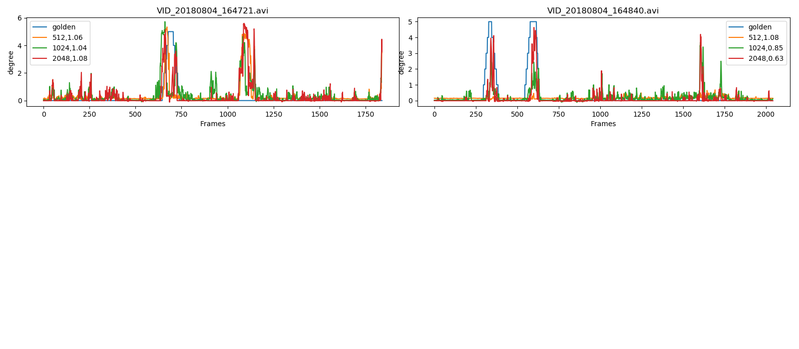
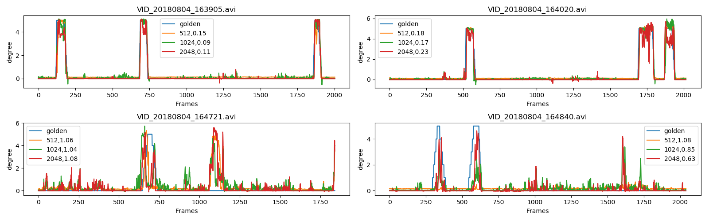

### Mobilenet
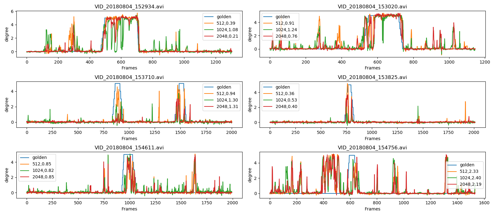
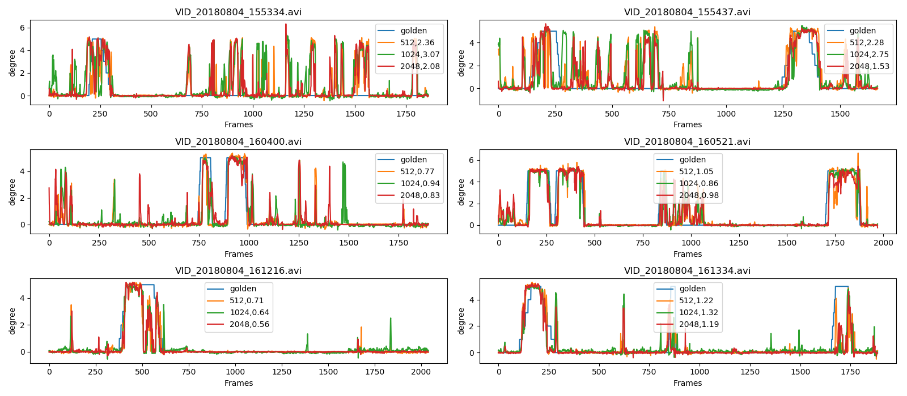
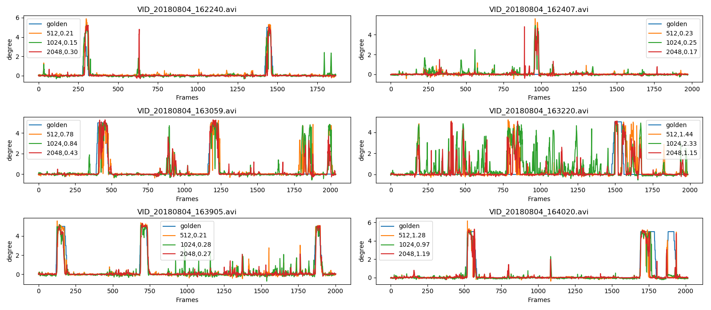
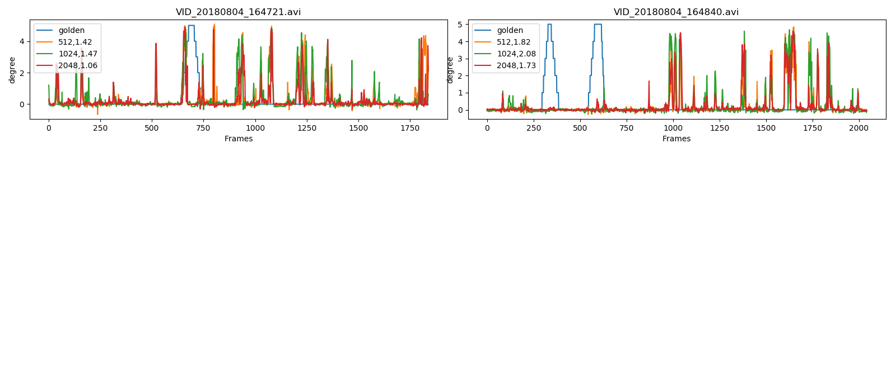
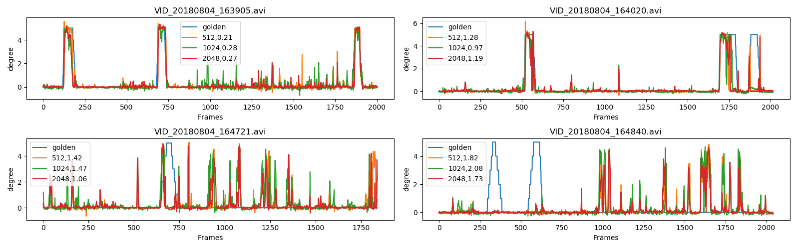

還是可以使用 512 features.


接下來要輕量化 extractor, 所以基於我們的 dataset 來 training mobilenet.

### Dense121 vs Mobilenet vs Trained Mobilenet
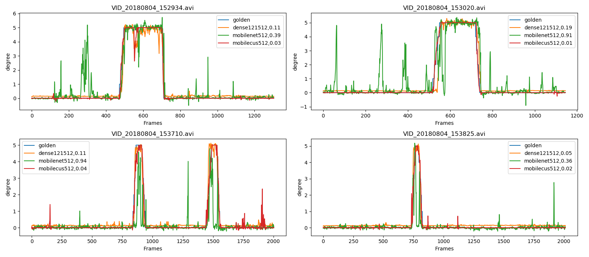
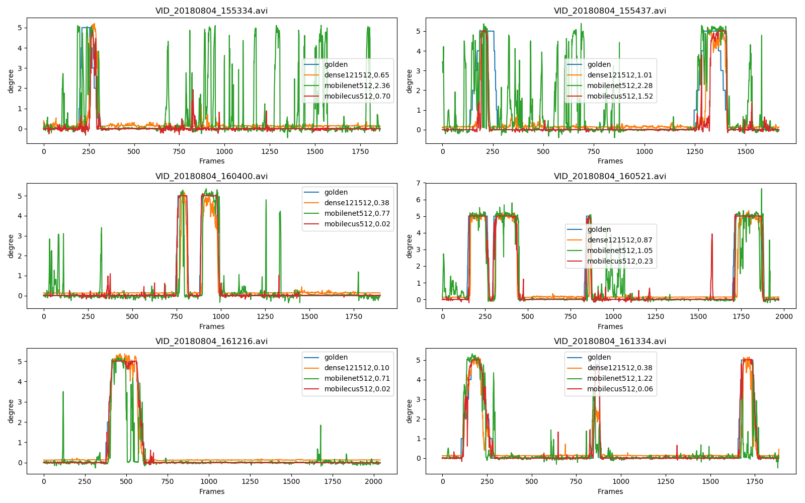
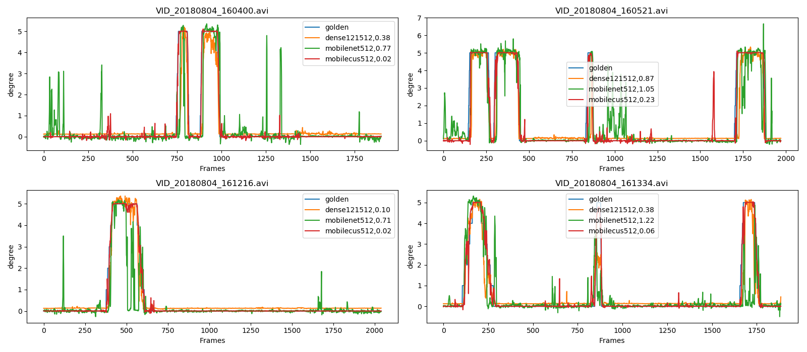
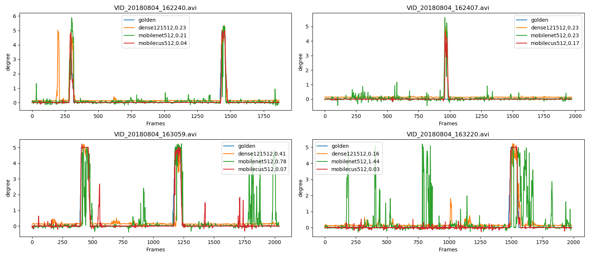
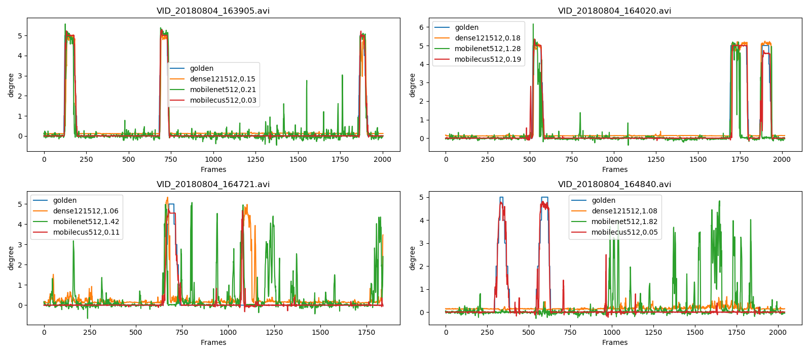

由結果可知, 可以利用 trained mobilenet 來抽 feature, 效果不錯, 同時 model 也比較小.

