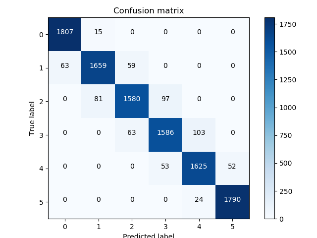

# Mouthnn_mtcnn - 基於 YawDD 及 aiaDDD 來找出適合的 mobilenet weighting.

與 Mouthnn 的目的相同, 只是這裡的嘴巴定位是使用 MTCNN, 所以效果應該會更好才對.

## 檔案及目錄

| Name | Description |
| ---- | -------- |
| MTCNN | MTCNN 的實作 (symbolic link) |
| mtcnn_face_det.py | mtcnn 找人臉的 class code |
| pic_gen_aiaDDD.py | 每個檔案去統計每個不同程度的 frame 張數, 最後隨機取一樣多的量來 training. |
| pic_gen_YawDD.py | 同上. |
| pic_train.py | 利用產生的圖檔來做後續 training 的動作. |
| pic_test.py | 存下每個 frame 的 confusion matrix 來驗證 training 結果正確性 |
| pic2fea.py | 把圖片抽成一個一個 feature, 用來做再對 mobilenet 輕量化 model 的 training. |


## 執行順序
```
$ python pic_gen_aiaDDD.py (會產生 deg0 ~ deg5 的 folder)
$ python pic_gen_YawDD.py
$ python pic_train.py (會把 deg0 ~ deg5 裡面的圖 copy 到 train, test folder 下, 最後 train 出來的結果是 mobilecus_fea_512.h5)
$ python pic_test.py
```
## 結果
Training 完的結果還不錯, customized mobilenet weighting 應有更好表現.


