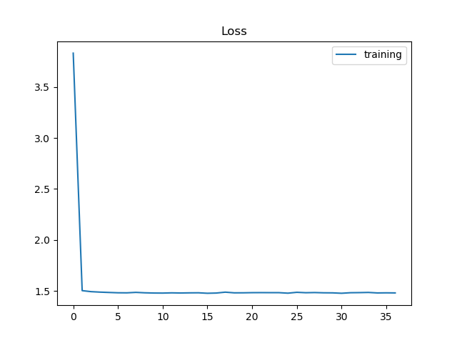
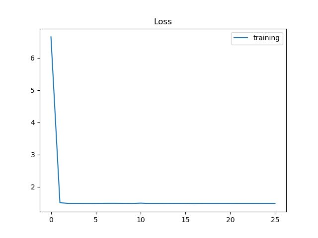
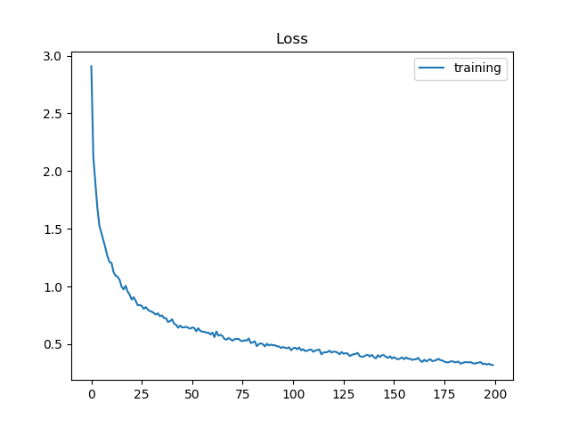
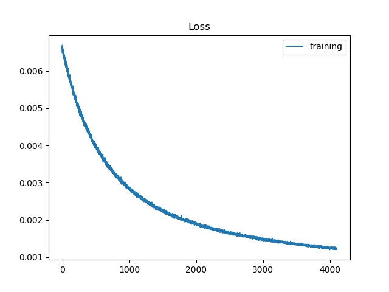

# 自己設計之 CNN model 來取代 Mobilenet 抽 feature 


Mobilenet 來抽 feature 還是太慢了, 因此設計自己的抽 feature model.

主要的修改有
- 把 input size 從 224x224 改為 100x100
- 把 input channel 數從 3 改為 1 (gray level)

## 目錄結構
子目錄包含了資料集、嘴巴特徵抽取訓練、判斷模型的訓練、demo流程四個子目錄.

| Name | Description |
| ---- | -------- |
| MTCNN | MTCNN 實作 (symbolic link) |
| mtcnn_face_det.py | MTCNN 找人臉的 class code |
| pic_gen_YawDD.py | 將 YawDD 裡 video frame 根據呵欠程度抽出來, 框出嘴巴部份存下來 |
| pic_gen_aiaDDD.py | 將 aiaDDD 裡 video frame 根據呵欠程度抽出來, 框出嘴巴部份存下來 |
| train_cnn.py | 直接設法去 fit mobilenet 抽出來的 feature |
| tf_pic_train.py | 使用 tensor flow 來由多程度的嘴巴照片來 training 出可分出呵欠程度的 model |
| tf_pic_valid.py | 驗證上述 model 的正確性 |
| keras_pic_train.py | 直接使用 keras 來 training |
| keras_pic_valid.py | 驗證上述 model 的正確性 |
| mouthnnym_fea_extract.py | 使用訓練好的 model 來抽 feature 的 class code |
| mouthnnym_fea_extract_tf.py | 使用 tensor flow model 檔 (model 在 mouthnnym_saved 目錄下) |
| mouthnnym_fea_extract_keras.py | 使用 keras model 檔 (mouthnnym_fea_512.h5) |

## 執行順序
```
$ python train_cnn.py (這個是直接 training 產生近似 mobilenet output 的 feature, 但結果不佳)
$ python pic_gen_YawDD.py
$ python pic_gen_aiaDDD.py (上述會產生 0, 1, 2, 3, 4, 5 等目錄, 然後搬到 test, train 目錄下)
$ python tf_pic_train.py
$ python tf_pic_valid.py (tensor flow 版本先試一次)
$ python keras_pic_train.py
$ python keras_pic_valid.py (Keras 版本也試一次)
```

## 結果

首先是想直接讓 Customized NN 抽的結果與 mobilenet 的結果愈像愈好, 使用 train_cnn.py 來調整 loss function.



loss 都很大, 一直都 train 不起來, 因此換直接 train 分類. 

中心思想很簡單, 可以分的好話也就代表可以抓到該抓的 features. Training 結果不錯:



